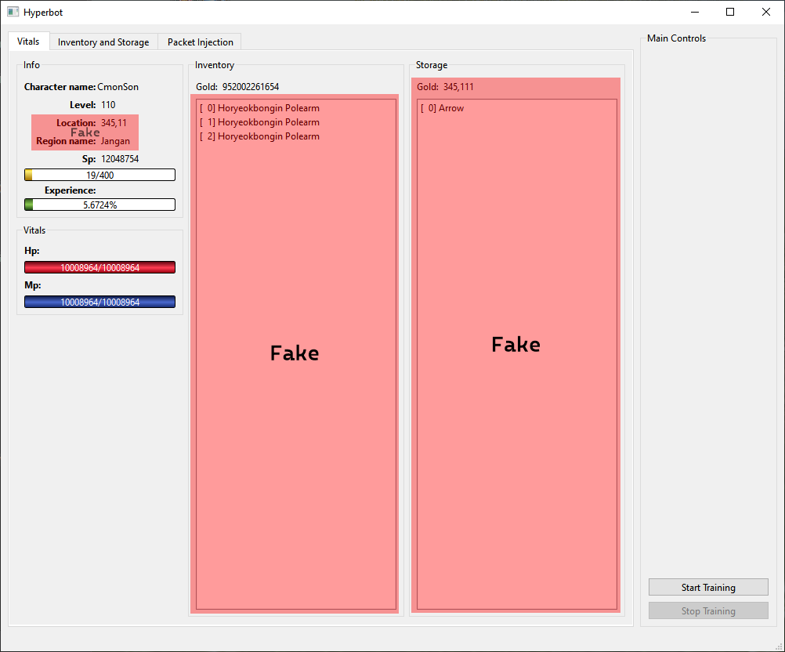

# Hyperbot UI

## Building

For VCPKG, add your CMAKE_TOOLCHAIN_FILE entry into the Initial Configuration in Qt under the Build Settings

There's a weird cyclic build issue because of SilkroadLib. It seems like I can get it to work by doing the following:
1. Comment out "add_subdirectory(SilkroadLib)"
2. Build the project, it will fail
3. Uncomment the line from #1
4. Build again. It should succeed