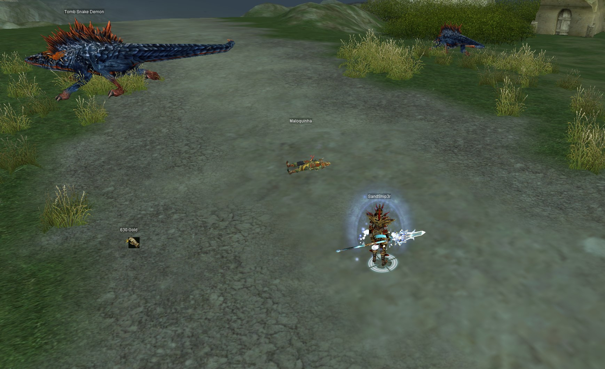

# Packet topics:
### Character location and movement, items dropped on the ground, and monsters' spawn, location, and health

- Party invite/accept/dismiss/request/kick
- Stall open/close
- Update stat Str/Int
- Chat
- Item movement in inventory
- Skill updates
- Alchemy
- Pet
- Berzerk
- Interface with NPC
- Equiping items
- Using item
- Attack
- Silk
- Teleport
- Repair
- Unique monster spawns
- Hp/Mp change
- Exp/sp
- Quit game
- Academy
- Quests

