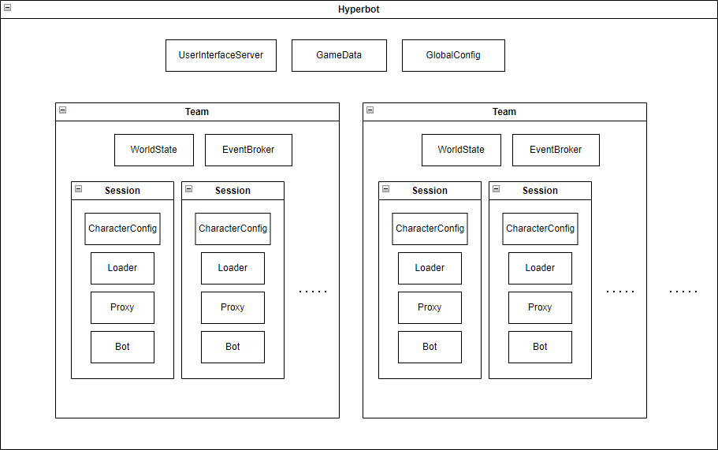

# Transcending To Become Multi-Character

This doc contains considerations made when evolving Hyperbot to control multiple characters concurrently.

## Teams

Originally, Hyperbot was designed to be a single intelligence which controls multiple characters which all collaborate. However, now that I am working on reinforcement learning for pvp, there is some information which should be hidden between opponents. For 1v1 pvp, each Session only being able to see its own events seems sufficient. Once I start working on multi-vs-multi pvp, it will be useful for some groups of characters to view each others' states/events, but other characters to not be able to view this state.

To support this information sharing boundary, the concept of Teams seems useful.

The following diagram shows what I am thinking:

A Team contains a list of sessions and a single WorldState.
Each Session should be able to see all Events related to the Team's WorldState, that includes Events from other Sessions in the Team.

### How Should EventBroker(s?) Work With Teams?

Since Events specific to a Team should not be visible by another Team, how do we partition the EventBroker?

#### Option 1 - One EventBroker Per Team

Pros:

- This creates natural separation so it will be extremely difficult for one Team to accidentally see events from another Team.

Cons:

- The UserInterface needs to see events of all teams. It would need to subscribe to multiple different EventBrokers.
  - The EventBroker creates unique IDs for each Event. If the UserInterface is receiving events from multiple EventBrokers, there will likely be duplicate IDs. This could be mitigated by having one global unique event ID creation point, but it seems weird why you'd want events to have unique event IDs between different EventBrokers.
- Threading becomes a bit tricky as team counts increase. If each team has its own EventBroker, that means one thread runs per team processing events. If later, one thread per team is not enough, then we'll probably introduce a threadpool for the EventBroker. Then will each EventBroker get a different threadpool? Or would they get access to the same threadpool?

#### Option 2 - One EventBroker For All

Pros:

- Threads are simple. Whatever we set up for the single EventBroker is shared between all teams.
- The UserInterface simply connects to the single EventBroker.

Cons:

- We need to explicitly avoid viewing another Team's events.

#### Choice: Option 2

I prefer Option 2, to avoid the threading complexity of multiple EventBrokers. To prevent viewing another Team's Events, each Event will have a Team ID and somewhere in the framework, other Teams' Events will be filtered out.